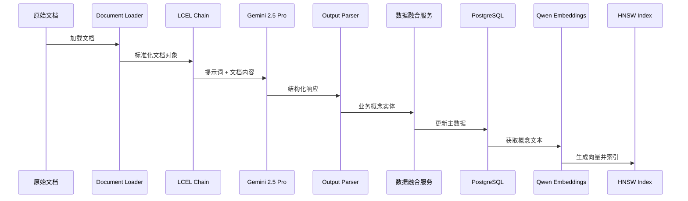
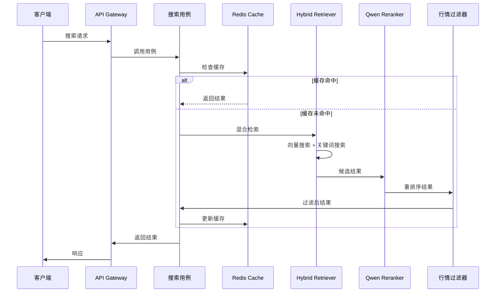

# **架构文档: 企业业务概念智能检索系统 (MVP)**

**文档版本**: 2.0
**创建日期**: 2025年7月19日
**架构师**: Winston

## **1. 高阶架构 (High Level Architecture)**

本系统将设计为一个**领域驱动（DDD）、模块化的服务导向架构**。其核心是一个围绕“数据管道”构建的智能引擎，遵循“提取-归档-融合-索引”的流程，最终通过一个采用**六边形架构**思想设计的、独立的API服务层暴露其检索能力。技术栈以Python和LangChain为核心，采用PostgreSQL作为集成的结构化与向量存储方案，并利用本地部署的Qwen模型执行Embedding和Rerank任务，以确保性能和数据私密性。整个开发流程将严格遵循**契约驱动**和\*\*测试驱动（TDD）\*\*的原则。

### **1.2 架构愿景与风格 (Architectural Vision & Style)**

  * **愿景**: 构建一个**领域驱动、组件化、可扩展**的业务概念智能检索系统，既保持当前的业务特色，又融入RAG最佳实践。
  * **架构风格**: 我们采纳**六边形架构（Hexagonal Architecture）作为核心风格。这意味着我们的核心业务逻辑（领域层和应用层）位于架构的中心，它不依赖于任何外部技术（如数据库、API框架）。所有的外部技术都作为“适配器”在基础设施层**实现，并通过在**应用层**定义的“端口”（接口）与核心业务逻辑交互。
  * **核心数据流**:
    1.  **离线管道 (Offline Pipeline)**: 定期或按需触发，读取原始文档，通过LLM提取结构化数据，经过融合与更新后，存入PostgreSQL主数据库，并同步构建向量索引。
    2.  **在线服务 (Online Service)**: 运行一个独立的API服务，接收用户查询，执行“检索-精排-排序-过滤”的实时计算，并返回最终结果。

### **1.3 高阶项目图 (分层视图)**

这张图直观地展示了六边形架构的思想，即我们的业务核心如何通过端口与外部世界交互：

```mermaid
graph TD
    subgraph "外部交互 (External Interaction)"
        UI[用户 / API客户端]
    end

    subgraph "系统核心 (System Core)"
        Interfaces[<b>接口层 (Interfaces)</b><br/>- FastAPI Routers<br/>- API 请求/响应模型 (Schemas)<br/>- 依赖注入]
        
        Application[<b>应用层 (Application)</b><br/>- 应用用例 (Use Cases)<br/>- 工作流编排 (Workflows)]
        
        Domain[<b>领域层 (Domain)</b><br/>- 业务实体与规则 (Entities)<br/>- 领域服务 (Services)]
        
        Infrastructure[<b>基础设施层 (Infrastructure)</b><br/>- LangChain集成 (Chains, Prompts)<br/>- 数据库与向量存储 (PostgreSQL)<br/>- 缓存、监控、LLM适配器]
    end

    UI --> Interfaces
    Interfaces --> Application
    Application --> Domain
    Application --> Infrastructure
```

### **1.4 核心架构与开发原则**

以下是我们项目必须共同遵守的、融合了架构思想和开发实践的最终原则，它将指导我们所有的技术决策和编码实践：

1.  **领域驱动设计 (DDD)**: 这是我们架构的顶层思想。所有代码都将围绕`Company`、`BusinessConcept`等核心领域实体来组织，确保业务逻辑的高度内聚。
2.  **六边形架构**: 这是DDD的实现方式，旨在实现业务与技术的彻底解耦。这一思想通过以下两个更具体的模式来落地：
      * **仓库模式 (Repository Pattern)**: 作为数据持久化层面的“适配器”，将业务逻辑与数据库操作解耦。
      * **依赖注入模式 (Dependency Injection)**: 作为服务协作层面的“适配器”，解耦服务模块，方便替换和测试。
3.  **契约驱动开发 (Contract-Driven Development)**: 以Pydantic 2.0定义的严格数据模型作为我们系统内部所有交互的“契约”，确保数据的准确性和一致性。
4.  **管道模式 (Pipeline Pattern)**: 我们的离线数据处理流程将组织成一个清晰、模块化的管道，每个阶段（提取、融合、索引）都是可独立测试和替换的。
5.  **测试驱动开发 (TDD)**: 遵循我们详细的测试策略，为所有核心业务逻辑编写测试用例，并基于“契约”和`mock`进行验证。
6.  **统一日志管理**: 所有模块都将使用统一的、结构化的日志记录服务，便于调试和线上维护。

### **1.5 核心数据流设计**

我们系统的动态行为将通过以下两张核心数据流图（时序图）来详细定义。

#### **1.5.1 离线处理流程**



#### **1.5.2 在线检索流程**



-----

## **2. 技术栈**

### **2.1 核心技术栈**

| 类别 | 技术/工具 | 版本 | 说明 |
|:---|:---|:---|:---|
| **语言/运行环境** | Python | **3.13** | 最新稳定版，性能优化 |
| **依赖管理** | uv (by Astral) | 最新稳定版 ||
| **核心框架** | | | |
| - AI框架 | LangChain | **>=0.3.26** | 核心 RAG 框架 |
| - 工作流 | LangGraph | **>=0.2.0** | 复杂工作流编排 |
| - Web框架 | FastAPI | **>=0.116.0** | 高性能异步 API |
| **数据存储** | | | |
| - 主数据库 | PostgreSQL | **16+** | 支持 pgvector |
| - 向量扩展 | pgvector | **>=0.7.0** | 支持 halfvec + HNSW |
| - 缓存 | Redis | **>=7.2** | 高性能缓存 |
| **LangChain 集成** | | | |
| - 数据库 | langchain-postgres | **>=0.0.12** | PostgreSQL 集成 |
| - 社区包 | langchain-community | **>=0.3.0** | 额外功能支持 |
| **模型服务** | | | |
| - LLM | Gemini 2.5 Pro | **最新** | 文档理解和提取 |
| - Embedding | Qwen3-Embedding-4B | **本地** | 2560维向量生成 |
| - Reranker | Qwen-Reranker | **本地** | 结果重排序 |
| **评估监控** | | | |
| - RAG评估 | RAGAS | **>=0.2.0** | RAG 专用评估框架 |
| - 追踪 | OpenTelemetry | **>=1.20.0** | 分布式追踪 |
| - 指标 | Prometheus | **>=0.19.0** | 指标收集 |

### **2.2 开发工具链**

| 工具 | 用途 | 版本 |
|:---|:---|:---|
| uv | 包管理 | 最新版 |
| Ruff | 代码检查 | >=0.1.0 |
| Black | 代码格式化 | >=24.0.0 |
| pytest | 测试框架 | >=8.0.0 |
| Docker | 容器化 | >=24.0 |

-----

## **3. 数据库详细设计**

本设计采纳了一套生产级的、高度范式化的表结构，旨在确保数据的完整性、可观测性、高性能和未来的可扩展性。

### **3.1 `companies` (公司主表)**
* **目的**: 存储每个公司的唯一、静态的身份信息。

| 字段名 | 数据类型 | 约束/索引 | 描述 |
| :--- | :--- | :--- | :--- |
| `company_code` | `VARCHAR(10)` | **PRIMARY KEY**, NOT NULL | 公司股票代码，作为唯一主键。 |
| `company_name_full` | `VARCHAR(255)` | UNIQUE, NOT NULL | 公司完整的官方名称。 |
| `company_name_short`| `VARCHAR(100)` | INDEX | 公司简称，建立索引以加速查询。 |
| `exchange` | `VARCHAR(50)` | | 上市交易所。 |
| `created_at` | `TIMESTAMPTZ` | DEFAULT NOW() | 记录创建时间。 |
| `updated_at` | `TIMESTAMPTZ` | DEFAULT NOW() | 记录最后更新时间。 |

---
### **3.2 `source_documents` (原始文档提取归档表 - 增强版)**
* **目的**: 永久、不可变地归档每一次的完整JSON提取结果，并记录处理元数据，确保了数据管道的幂等性、可观测性和容错能力。

| 字段名 | 数据类型 | 约束/索引 | 描述 |
| :--- | :--- | :--- | :--- |
| `doc_id` | `UUID` | **PRIMARY KEY** | 文档提取记录的唯一ID。 |
| `company_code` | `VARCHAR(10)` | **FOREIGN KEY** -> companies.company_code | 关联到`companies`表。 |
| `doc_type` | `VARCHAR(50)` | NOT NULL | 文档类型 ("annual_report", "research_report")。 |
| `doc_date` | `DATE` | NOT NULL | 文档的发布日期。 |
| `report_title` | `TEXT` | | 研报或年报的标题。 |
| `file_path` | `TEXT` | | 原始文件的存储路径，用于溯源。 |
| `file_hash` | `VARCHAR(64)`| | 文件的SHA-256哈希值，用于避免重复处理。 |
| `raw_llm_output` | `JSONB` | NOT NULL | 存储从LLM返回的完整JSON。 |
| `extraction_metadata`| `JSONB` | | 存储提取元数据 (模型, 提示版本, token消耗, 耗时)。 |
| `processing_status`| `VARCHAR(20)`| DEFAULT 'completed' | 处理状态 (`completed`, `failed`, `pending`)。 |
| `error_message` | `TEXT` | | 如果处理失败，记录错误信息。 |
| `created_at` | `TIMESTAMPTZ` | DEFAULT NOW() | 记录归档时间。 |
| **索引** | | `INDEX (company_code, doc_date DESC)` | 优化按公司查找最新文档的查询。 |

---
### **3.3 `business_concepts_master` (业务概念主数据表 - 优化版)**
* **目的**: 存储经过“融合更新”算法处理后的、每个公司当前最权威、最全面的业务概念画像。

| 字段名 | 数据类型 | 约束/索引 | 描述 |
| :--- | :--- | :--- | :--- |
| `concept_id` | `UUID` | **PRIMARY KEY** | 业务概念的唯一ID。 |
| `company_code` | `VARCHAR(10)` | **FOREIGN KEY** -> companies.company_code, INDEX | 关联到`companies`表。 |
| `concept_name` | `VARCHAR(255)` | NOT NULL | 业务概念的通用名称。 |
| `concept_category`| `VARCHAR(50)` | NOT NULL | 概念类别 ("核心业务", "新兴业务", "战略布局")。 |
| `importance_score`| `DECIMAL(3,2)`| NOT NULL, INDEX | 重要性评分 (0-1)，已索引以优化排序。 |
| `development_stage`| `VARCHAR(50)` | | 发展阶段。 |
| `embedding` | `halfvec(2560)`| **HNSW INDEX**, NOT NULL | 使用`halfvec`节省存储。**必须使用HNSW索引**以实现超高速相似度查询。 |
| `concept_details` | `JSONB` | NOT NULL | 存储该概念的其他详细信息 (`description`, `timeline`, `metrics`等)。 |
| `last_updated_from_doc_id` | `UUID` | FOREIGN KEY -> source_documents.doc_id | 指向`source_documents`表，用于追溯最新信息来源。 |
| `version` | `INTEGER` | DEFAULT 1 | 用于乐观锁的版本控制。 |
| `is_active` | `BOOLEAN` | DEFAULT true | 软删除标记。 |
| `created_at` | `TIMESTAMPTZ`| DEFAULT NOW() | 记录创建时间。 |
| `updated_at` | `TIMESTAMPTZ`| DEFAULT NOW() | 记录该概念的最后更新时间。 |

---
### **3.4 `concept_relations` (概念关系表)**
* **目的**: 将产业链关系范式化，使系统具备初步的知识图谱分析能力。

| 字段名 | 数据类型 | 约束/索引 | 描述 |
| :--- | :--- | :--- | :--- |
| `relation_id` | `UUID` | **PRIMARY KEY** | 关系记录的唯一ID。 |
| `source_concept_id`| `UUID` | **FOREIGN KEY** -> business_concepts_master.concept_id | 关联到源业务概念。 |
| `target_entity_type`| `VARCHAR(50)` | NOT NULL | 目标实体类型 (e.g., "customer", "partner")。 |
| `target_entity_name`| `VARCHAR(255)`| NOT NULL | 目标实体的名称。 |
| `created_at` | `TIMESTAMPTZ`| DEFAULT NOW() | 记录创建时间。 |

---
### **3.5 `search_history` (搜索历史表)**
* **目的**: 记录所有查询和用户反馈，为系统评估、算法迭代和用户行为分析提供数据基础。

| 字段名 | 数据类型 | 约束/索引 | 描述 |
| :--- | :--- | :--- | :--- |
| `search_id` | `UUID` | **PRIMARY KEY** | 搜索记录的唯一ID。 |
| `query_company_code`| `VARCHAR(10)` | | 查询的公司代码。 |
| `search_params` | `JSONB` | | 本次搜索的完整参数 (top_k, market_filters等)。 |
| `result_company_codes`|`TEXT[]` | | 返回的公司代码列表。 |
| `result_scores` |`DECIMAL[]` | | 对应的相关性分数列表。 |
| `user_feedback` | `JSONB` | | 用户反馈 (e.g., 点击了哪个结果, 标记了哪个结果的好坏)。 |
| `response_time_ms`| `INTEGER` | | 本次查询的响应耗时（毫秒）。 |
| `created_at` | `TIMESTAMPTZ`| DEFAULT NOW() | 记录搜索时间。 |

---
### **3.6 `retrieval_cache` (检索缓存表)**
* **目的**: 缓存高频查询的结果，提升用户体验，降低计算成本。

| 字段名 | 数据类型 | 约束/索引 | 描述 |
| :--- | :--- | :--- | :--- |
| `cache_key` |`VARCHAR(255)`| **PRIMARY KEY** | 缓存的唯一键 (通常是请求参数的哈希值)。 |
| `result_data` | `JSONB` | NOT NULL | 缓存的完整API响应体。 |
| `expires_at` | `TIMESTAMPTZ`| | 缓存过期时间。 |
| `created_at` | `TIMESTAMPTZ`| DEFAULT NOW() | 记录创建时间。 |
| `updated_at` | `TIMESTAMPTZ`| DEFAULT NOW() | 记录最后更新时间。 |


-----

## **4. 源代码目录结构 (Source Tree)**

```plaintext
/AShareInsight/
├── .venv/                  # 由uv管理的Python虚拟环境
├── src/
│   ├── domain/                     # 【领域层】核心业务逻辑，不依赖任何框架
│   │   ├── entities/               # 领域实体 (e.g., company.py, business_concept.py)
│   │   └── services/               # 领域服务 (e.g., similarity_calculator.py, data_fusion.py)
│   │
│   ├── application/                # 【应用层】编排领域服务，完成具体用例
│   │   ├── use_cases/              # 应用用例 (e.g., search_similar_companies.py)
│   │   └── ports/                  # 端口接口定义 (e.g., VectorStorePort, LLMServicePort)
│   │
│   ├── infrastructure/             # 【基础设施层】技术实现与外部服务集成
│   │   ├── persistence/            # 持久化适配器
│   │   │   └── postgres/           #   - PostgreSQL仓储实现和pgvector集成
│   │   ├── llm/                    # LLM集成适配器
│   │   │   └── langchain/          #   - LangChain链、提示模板、解析器
│   │   ├── document_processing/    # 文档处理适配器 (e.t., 年报/研报加载器)
│   │   └── monitoring/             # 监控适配器 (e.g., 指标收集, 链路追踪)
│   │
│   ├── interfaces/                 # 【接口层】与外部世界的交互
│   │   ├── api/                    # REST API (FastAPI)
│   │   │   ├── v1/
│   │   │   │   ├── routers/        # API路由定义
│   │   │   │   └── schemas/        # 请求/响应的Pydantic模型 ("契约")
│   │   └── cli/                    # 命令行接口 (用于运行离线管道)
│   │
│   └── shared/                     # 【共享层】跨层组件
│       ├── config/                 # 配置管理
│       └── exceptions/             # 自定义异常
│
├── tests/                          # 测试
│   ├── unit/                       # 单元测试 (隔离测试单个模块)
│   ├── integration/                # 集成测试 (测试模块间的交互)
│   └── e2e/                        # 端到端测试 (通过API测试完整流程)
│
├── scripts/                        # 辅助脚本
│   ├── migration/                  # 数据库迁移脚本
│   └── evaluation/                 # RAG评估脚本
│
├── config/                         # 部署配置文件 (development.yaml, production.yaml)
│
├── pyproject.toml          # uv管理的项目配置与依赖
└── README.md               # 项目说明文档
└── docker/                         # Docker 相关
    ├── Dockerfile
    └── docker-compose.yaml
```
-----

## **5. API详细契约**

此契约将由`interfaces/api/v1/`模块负责实现，其中请求和响应的Pydantic模型将定义在`schemas/`子目录中。

### **Endpoint: `POST /api/v1/search/similar-companies`**

  * **描述**: 根据输入的核心公司，检索并返回业务概念上相关的其他上市公司列表。
  * **查询参数 (Query Parameters)**:
      * `include_justification` (boolean, optional, default: `false`): **【新增】** 是否在返回结果中包含详细的匹配理由和溯源证据。

### **5.1 请求体 (Request Body)**

  * **Content-Type**: `application/json`

| 字段名 | 数据类型 | 是否必需 | 描述 |
| :--- | :--- | :--- | :--- |
| `query_identifier` | `string` | **是** | 要查询的公司简称或股票代码 (例如: "华润微" 或 "688396")。 |
| `top_k` | `integer` | 否 (默认: 20) | 希望返回的相关公司数量上限。 |
| `market_filters` | `object` | 否 | 行情数据过滤器，用于对最终结果进行筛选。 |
|  L `max_market_cap_cny` | `integer` | 否 | **最大市值** (人民币)。只返回市值低于此值的公司。 |
| L `min_5day_avg_volume` | `integer` | 否 | **最小5日平均成交额**。只返回近期成交额高于此值的公司。 |

**请求示例:**

```json
{
  "query_identifier": "开立医疗",
  "top_k": 10,
  "market_filters": {
    "max_market_cap_cny": 50000000000
  }
}
```

### **5.2 成功响应 (Success Response)**

  * **Code**: `200 OK`
  * **Content-Type**: `application/json`

| 字段名 | 数据类型 | 描述 |
| :--- | :--- | :--- |
| `query_company`| `object` | 本次查询的核心公司信息。 |
| L `name` | `string` | 公司简称。 |
| L `code` | `string` | 公司代码。 |
| `metadata` | `object` | **【新增】** 关于本次查询的元数据。 |
| L `total_results_before_limit` | `integer`| 在应用`top_k`限制前，找到的相关公司总数。 |
| L `filters_applied` | `object` | 本次查询实际生效的过滤器。 |
| `results` | `array` of `object` | 相关公司列表，按`relevance_score`降序排列。 |
| L `company_name`| `string` | 相关公司的简称。 |
| L `company_code`| `string` | 相关公司的代码。 |
| L `relevance_score`| `float` | 综合相关性评分 (0-1)。 |
| L `matched_concepts`| `array` of `object` | 匹配到的核心业务概念列表。 |
|     L `name` | `string` | 匹配到的业务概念名称。 |
|     L `similarity_score` | `float` | 该概念与源公司概念的相似度分数。 |
| L `justification`| `object` | **【变为可选】** 仅当`include_justification=true`时才会出现。 |
|     L `summary` | `string` | 自动生成的简明匹配理由。 |
|     L `supporting_evidence` | `array` of `string`| 溯源证据。 |

**响应示例 (当`include_justification=true`时):**

```json
{
  "query_company": {
    "name": "开立医疗",
    "code": "300633"
  },
  "metadata": {
    "total_results_before_limit": 152,
    "filters_applied": {
      "max_market_cap_cny": 50000000000
    }
  },
  "results": [
    {
      "company_name": "迈瑞医疗",
      "company_code": "300760",
      "relevance_score": 0.89,
      "matched_concepts": [
        { "name": "超声业务", "similarity_score": 0.92 },
        { "name": "内镜业务", "similarity_score": 0.85 }
      ],
      "justification": {
        "summary": "因在[超声业务]、[内镜业务]等核心业务上高度重叠而相关。",
        "supporting_evidence": [
          "迈瑞医疗：公司超声影像产品线齐全...",
          "开立医疗：超声板块高端S80/P80系列正式推出..."
        ]
      }
    }
  ]
}
```

### **5.3 错误响应 (Error Responses)**

  * **Code**: `404 Not Found`: 传入的`query_identifier`在数据库中找不到对应的公司。
  * **Code**: `422 Unprocessable Entity`: 请求体中的参数类型错误。
  * **Code**: `500 Internal Server Error`: 服务器内部发生未知错误。

-----

Winston在此。收到`*doc-out`指令。

我们继续构建《架构文档》，现在是**第六部分：基础设施与部署策略**。

我将融合我们之前关于私有化部署的详细讨论和优化方案中的最佳实践，为您提供一份完整的、可执行的方案。

-----

## **6. 基础设施与部署策略 (私有化部署版)**

本策略旨在确保我们的系统能够安全、可靠、且自动化地在公司内部网络中进行部署和运维。

### **6.1 环境策略 (Environment Strategy)**

我们将设立三个标准环境，以确保软件质量和发布的稳定性：

  * **开发环境 (Development)**: 在每位开发者的本地电脑上，使用 **Docker Compose** 运行，以保证开发环境的一致性。
  * **预发布环境 (Staging)**: 部署在**公司内部的一台或一组指定的服务器**上，作为生产环境的镜像，用于集成测试和最终验收。
  * **生产环境 (Production)**: 部署在**公司内部的数据中心或核心服务器**上，为最终用户提供服务。

### **6.2 容器化 (Containerization)**

  * 我们将使用 **Docker** 将我们的Python应用（包括API服务和离线数据管道）及其所有依赖项打包成一个标准的、可移植的容器镜像。
  * **理由**: 容器化确保了无论在开发、测试还是生产环境，我们的应用都运行在完全一致的环境中，极大地减少了因环境差异导致的问题，并简化了部署流程。

### **6.3 持续集成/持续部署 (CI/CD)**

  * **核心模式**: 我们采用\*\*“云端CI + 内网CD”\*\*的混合模式，兼顾了GitHub Actions的强大功能与内网部署的安全性。

  * **工具**: **GitHub Actions**。

  * **工作原理**:

    1.  **CI阶段 (在云端)**: 当代码被推送到GitHub仓库时，GitHub的云端运行器会自动执行测试、代码检查、构建Docker镜像等任务。
    2.  **镜像推送**: 构建成功的镜像将被推送到我们部署在内网的**私有镜像仓库**（如Harbor）。
    3.  **CD阶段 (在内网)**: GitHub Actions会将“部署”任务分发给一个安装在您公司内网服务器上的**自托管运行器 (Self-hosted Runner)**。此运行器主动连接GitHub，无需在防火墙上为外部访问开放任何端口，确保了安全性。
    4.  **执行部署**: 该自托管运行器从私有镜像仓库拉取最新镜像，并执行`scripts/deployment/`目录下的部署脚本，在目标服务器上完成最终部署（例如，通过`docker-compose up -d`）。

  * **部署流程图**:

    ```mermaid
    sequenceDiagram
        participant Dev as Developer
        participant GH as GitHub / GitHub Actions Cloud
        participant Runner as Self-hosted Runner<br/>(在您的内网)
        participant Registry as 私有镜像仓库<br/>(在您的内网)
        participant Server as 最终部署服务器<br/>(在您的内网)

        Dev->>+GH: 1. 推送代码 (git push)
        GH->>GH: 2. 在云端执行CI (测试, 构建镜像)
        GH->>+Registry: 3. 推送Docker镜像
        GH->>+Runner: 4. 分发“部署”任务
        Runner->>-Registry: 5. 拉取最新镜像
        Runner->>-Server: 6. 执行部署脚本
        GH-->>-Dev: 7. 通知部署结果
    ```

### **6.4 内部基础设施 (On-Premise Infrastructure)**

| 服务类型 | **私有化部署方案** | 理由与说明 |
| :--- | :--- | :--- |
| **应用运行环境** | **Docker Compose** (MVP) 或 **Kubernetes (K3s)** (未来扩展) | `Docker Compose`足以满足MVP阶段的单机部署需求，简单高效。未来若需高可用和自动伸缩，可平滑迁移至轻量级的K3s集群。 |
| **数据库服务** | **自建PostgreSQL数据库实例** (容器化部署) | 我们将在内部服务器上，以Docker容器的形式部署一个PostgreSQL数据库实例。**注意**: 数据库的备份、监控和版本升级等运维工作将需要由内部团队负责。 |
| **容器镜像仓库** | **私有镜像仓库 (Private Registry)** | 我们需要在内部搭建一个私有的Docker镜像仓库，用于安全地存放我们构建好的应用镜像。业界成熟的开源方案有 **Harbor**。 |

-----

## **7. 错误处理与日志记录策略**

### **7.1 API层的错误处理：全局异常捕获**

  * **策略**: 在`interfaces/api/`模块中设置一个**全局异常处理器 (Global Exception Handler)**。此中间件将捕获所有未处理的异常，并将其转化为标准化的JSON错误响应。
  * **自定义异常**: 具体的业务异常将在`src/shared/exceptions/`中定义。
  * **标准错误响应体**:
    ```json
    {
      "error": {
        "code": "INTERNAL_SERVER_ERROR",
        "message": "系统内部发生未知错误，请联系管理员。",
        "request_id": "uuid-..." 
      }
    }
    ```

### **7.2 离线数据管道的错误处理：高容错性**

  * **策略**: 数据处理流程需具备容错能力，不能因单个文件失败而中断。
  * **实现**:
    1.  **独立事务**: 每个文档的处理都是一个独立的事务。
    2.  **“死信队列”**: 处理失败的文档将被移入一个专门的列表或表中，并记录错误信息，以便人工排查。
    3.  **持续执行**: 管道将跳过失败的文档，继续处理下一个。

### **7.3 统一的结构化日志**

  * **策略**: 所有模块都将使用统一的、结构化的日志记录服务。
  * **实现**:
    1.  **JSON格式**: 所有日志以结构化的JSON格式输出。
    2.  **链路追踪**: 在`infrastructure/monitoring/`中集成`OpenTelemetry`，为API请求和后台任务生成唯一的`request_id`或`trace_id`，并将其包含在所有相关日志中，以便追踪完整的处理链路。

-----

## **8. 测试策略**

### **8.1 测试金字塔 (Testing Pyramid)**

  * **单元测试 (Unit Tests)**: 占比最高，用于测试`domain`层等单个、独立的业务逻辑模块。
  * **集成测试 (Integration Tests)**: 用于测试模块间的协作，如`application`层调用`infrastructure`层的适配器。
  * **端到端测试 (End-to-End Tests)**: 通过`interfaces/api/`接口，对整个系统进行完整的黑盒测试。

### **8.2 测试工具与实践**

  * **工具**: `pytest`, `pytest-mock`。
  * **测试数据**: 测试中使用的数据和配置将存放在`tests/fixtures/`目录中。
  * **E2E测试环境**: E2E测试将运行在部署了完整应用的预发布（Staging）环境上，并连接到一个预置了真实数据的专用数据库。

### **8.3 RAG质量评估 (RAG Quality Evaluation)**

  * **目标**: 持续量化和监控我们检索系统的核心质量。
  * **工具**: `RAGAS` 框架。
  * **实现**: 在`scripts/evaluation/`目录中创建评估脚本，定期运行，以评估`context_precision`, `context_recall`等关键RAG指标，确保模型和提示词的迭代能带来正面效果。

-----

## **9. 编码标准与规范**

  * **代码格式化与检查**: **Black** 和 **Ruff**，通过CI流程强制执行。
  * **命名规范**: 严格遵守Python官方的 **PEP 8**。
  * **类型提示与模型**: **必须**使用类型提示，所有数据模型**必须**基于 **Pydantic 2.0** (`from pydantic import BaseModel`) 进行构建。
  * **文档字符串**: 所有公开的模块、类和函数**必须**包含Google风格的Docstrings。

-----

## **10. 安全策略**

  * **API认证**: MVP阶段采用**API密钥认证** (`X-API-KEY` 请求头)。
  * **依赖安全**: 在CI/CD流程中集成 `uv pip audit` 自动扫描已知漏洞。
  * **数据安全**: 数据库连接使用TLS/SSL加密；所有凭证通过`shared/config/`模块从环境变量中安全加载，严禁硬编码。
  * **输入验证**: 由FastAPI与`interfaces/api/v1/schemas/`中定义的Pydantic模型自动处理所有API请求的输入验证。

-----

## **11. 实施路线图**

我们将采纳优化方案中建议的、更详细的敏捷迭代路线图。

### **第一阶段：基础重构（2-3周）**

  * **Sprint 1**: 建立新的DDD目录结构，定义所有`domain`层的实体和服务接口，并编写单元测试。
  * **Sprint 2**: 实现`application`层的核心用例和端口接口，并编写集成测试。

### **第二阶段：LangChain 深度集成（3-4周）**

  * **Sprint 3**: 在`infrastructure`层实现文档加载器和基于V5提示词的LLM提取器。
  * **Sprint 4**: 实现基于`langchain-postgres`的混合搜索和高级RAG链。

### **第三阶段：高级功能（4-5周）**

  * **Sprint 5**: 集成`RAGAS`评估框架，并添加`OpenTelemetry`链路追踪。
  * **Sprint 6**: 实现多级缓存策略，并进行负载测试与调优。

### **第四阶段：生产就绪（2-3周）**

  * **Sprint 7**: 完善API文档，实现健康检查，构建CI/CD流程。
  * **Sprint 8**: 准备API版本管理和未来的扩展方案。

-----