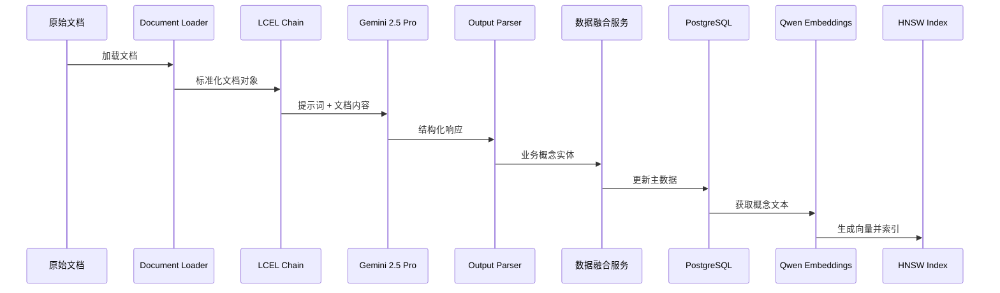
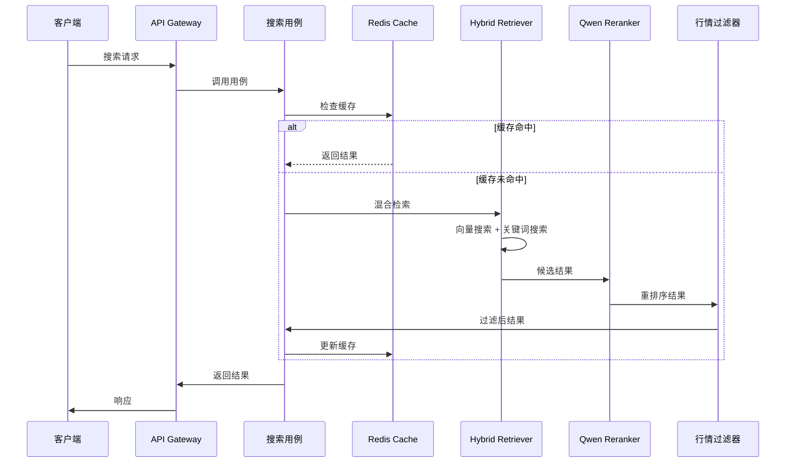

# **1. 高阶架构 (High Level Architecture)**

本系统将设计为一个**领域驱动（DDD）、模块化的服务导向架构**。其核心是一个围绕“数据管道”构建的智能引擎，遵循“提取-归档-融合-索引”的流程，最终通过一个采用**六边形架构**思想设计的、独立的API服务层暴露其检索能力。技术栈以Python和LangChain为核心，采用PostgreSQL作为集成的结构化与向量存储方案，并利用本地部署的Qwen模型执行Embedding和Rerank任务，以确保性能和数据私密性。整个开发流程将严格遵循**契约驱动**和\*\*测试驱动（TDD）\*\*的原则。

## **1.2 架构愿景与风格 (Architectural Vision & Style)**

  * **愿景**: 构建一个**领域驱动、组件化、可扩展**的业务概念智能检索系统，既保持当前的业务特色，又融入RAG最佳实践。
  * **架构风格**: 我们采纳**六边形架构（Hexagonal Architecture）作为核心风格。这意味着我们的核心业务逻辑（领域层和应用层）位于架构的中心，它不依赖于任何外部技术（如数据库、API框架）。所有的外部技术都作为“适配器”在基础设施层**实现，并通过在**应用层**定义的“端口”（接口）与核心业务逻辑交互。
  * **核心数据流**:
    1.  **离线管道 (Offline Pipeline)**: 定期或按需触发，读取原始文档，通过LLM提取结构化数据，经过融合与更新后，存入PostgreSQL主数据库，并同步构建向量索引。
    2.  **在线服务 (Online Service)**: 运行一个独立的API服务，接收用户查询，执行“检索-精排-排序-过滤”的实时计算，并返回最终结果。

## **1.3 高阶项目图 (分层视图)**

这张图直观地展示了六边形架构的思想，即我们的业务核心如何通过端口与外部世界交互：

```mermaid
graph TD
    subgraph "外部交互 (External Interaction)"
        UI[用户 / API客户端]
    end

    subgraph "系统核心 (System Core)"
        Interfaces[<b>接口层 (Interfaces)</b><br/>- FastAPI Routers<br/>- API 请求/响应模型 (Schemas)<br/>- 依赖注入]
        
        Application[<b>应用层 (Application)</b><br/>- 应用用例 (Use Cases)<br/>- 工作流编排 (Workflows)]
        
        Domain[<b>领域层 (Domain)</b><br/>- 业务实体与规则 (Entities)<br/>- 领域服务 (Services)]
        
        Infrastructure[<b>基础设施层 (Infrastructure)</b><br/>- LangChain集成 (Chains, Prompts)<br/>- 数据库与向量存储 (PostgreSQL)<br/>- 缓存、监控、LLM适配器]
    end

    UI --> Interfaces
    Interfaces --> Application
    Application --> Domain
    Application --> Infrastructure
```

## **1.4 核心架构与开发原则**

以下是我们项目必须共同遵守的、融合了架构思想和开发实践的最终原则，它将指导我们所有的技术决策和编码实践：

1.  **领域驱动设计 (DDD)**: 这是我们架构的顶层思想。所有代码都将围绕`Company`、`BusinessConcept`等核心领域实体来组织，确保业务逻辑的高度内聚。
2.  **六边形架构**: 这是DDD的实现方式，旨在实现业务与技术的彻底解耦。这一思想通过以下两个更具体的模式来落地：
      * **仓库模式 (Repository Pattern)**: 作为数据持久化层面的“适配器”，将业务逻辑与数据库操作解耦。
      * **依赖注入模式 (Dependency Injection)**: 作为服务协作层面的“适配器”，解耦服务模块，方便替换和测试。
3.  **契约驱动开发 (Contract-Driven Development)**: 以Pydantic 2.0定义的严格数据模型作为我们系统内部所有交互的“契约”，确保数据的准确性和一致性。
4.  **管道模式 (Pipeline Pattern)**: 我们的离线数据处理流程将组织成一个清晰、模块化的管道，每个阶段（提取、融合、索引）都是可独立测试和替换的。
5.  **测试驱动开发 (TDD)**: 遵循我们详细的测试策略，为所有核心业务逻辑编写测试用例，并基于“契约”和`mock`进行验证。
6.  **统一日志管理**: 所有模块都将使用统一的、结构化的日志记录服务，便于调试和线上维护。

## **1.5 核心数据流设计**

我们系统的动态行为将通过以下两张核心数据流图（时序图）来详细定义。

### **1.5.1 离线处理流程**



### **1.5.2 在线检索流程**



-----
